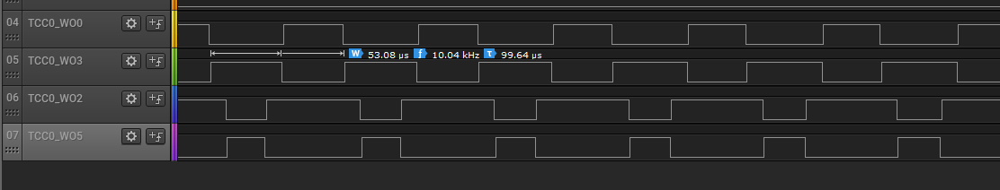

# TCC PWM generation

This example application shows how to use the TCC to generate a 2 or 3 phase PWM signals for motor control with dead time.

## Description

TCC module is configured to generate synchronous 2 or 3 phase PWM signals with dead time. The duty cycle of the PWM signals is updated in the period interrupt handler.

## Downloading and building the application

To clone or download this application from Github, go to the [main page of this repository](https://github.com/Microchip-MPLAB-Harmony/csp_apps_pic32cxbz6_wbz6) and then click **Clone** button to clone this repository or download as zip file.
This content can also be downloaded using content manager by following these [instructions](https://github.com/Microchip-MPLAB-Harmony/contentmanager/wiki).

Path of the application within the repository is **apps/tcc/tcc_synchronous_pwm_channels** .

To build the application, refer to the following table and open the project using its IDE.

| Project Name      | Description                                    |
| ----------------- | ---------------------------------------------- |
| WBZ653_curiosity.X  | MPLABX project for [PIC32CX WBZ653 Curiosity Board]() |
|||

## Setting up the hardware

The following table shows the target hardware for the application projects.

| Project Name| Board|
|:---------|:---------:|
| WBZ653_curiosity.X | [PIC32CX WBZ653 Curiosity Board]()
|||

### Setting up [PIC32CX WBZ653 Curiosity Board]()

- Connect the Debug USB port on the board to the computer using a micro USB cable

## Running the Application

1. Build and Program the application using its IDE
2. Observe the high-side and low-side PWM waveforms on oscilloscope
3. Observe the dead time of 1us between the high side and the low side
4. Observe the pwm frequency to be 10 KHz

[PIC32CX WBZ653 Curiosity Board]() pin details:

|Signal Name| Pad   | Pin |
|-----------|-------|-----|
| TCC0-WO0  | PB00   | Pin 9 of Xpro Header |
| TCC0-WO2  | PB01  | Pin 15 of Xpro Header |
| TCC0-WO3  | PD03  | Pin 10 of Xpro Header |
| TCC0-WO5  | PD04  | Pin 3 of Xpro Header |
||||

  
